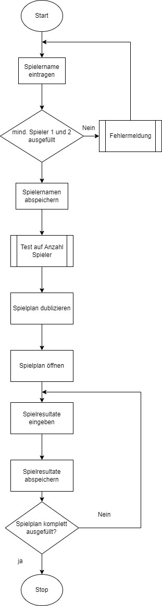

# Read Me
### Ausgangslage
Eines von meinen lieblings Spielen ist das Yatzy. Dieses Spiel beinhaltet lediglich fünf Spielwürfel, eine Punktetabelle und ein Bleistift um die Punkte in der Tabelle einzutragen. Da ich etwas für die Umwelt tun möchte und ich dieses Spiel sehr gerne spiele, kam ich auf die Idee die Punktetabelle zu digitalisieren.
### Funktion / Projektidee
Die Applikation soll anhand der Spieleranzahl eine Punktetabelle erstellen, in die alle Punkte eingetragen werden. Diese Punktetabelle soll mit dem Zeitstempel versehen und für die Zukunft abgespeichert werden.

Die gespeicherten Punktetabellen sollen miteinander verglichen werden können. Durch die Vergleiche sollen Statistiken dargestellt werden können. Ebenso soll über alle gespielten Yatzy-Spiele hinweg eine Highscore-liste erstellt werden, die den Namen des Spielers und die erzielte Punktzahl anzeigt.
## Workflow
### Dateneingabe
Zu Beginn werden alle Namen der Spieler erfasst. Falls bereits ein Spiel gespielt wurde, werden diese Namen zur Auswahl aufgelistet. So kann man seinen eigenen Highscore verbessern und am Ende eine bessere Analyse aus den verschiedensten Spielen ziehen.

Während dem Yatzy-Spiel werden die Punkte in der Tabelle eingetragen. Sobald diese eingetragen wurden, wird ein automatischer Speicherprozess eingeleitet. Dies Hilft dabei, die Daten auch bei einem Netzwerkausfall oder Laptopabsturz zu behalten.
### Datenausgabe
Die Daten werden gespeichert und zur Analyse bereitgestellt. Ebenso wird immer eine Highscore-Liste unter Ranking angezeigt. Diese wird immer am Ende jedes Spieles aktualisiert.
## Bedienung
Zur Verwendung der Applikation muss die main.py Datei gestartet werden.
## Diagramm
### Neues Spiel
