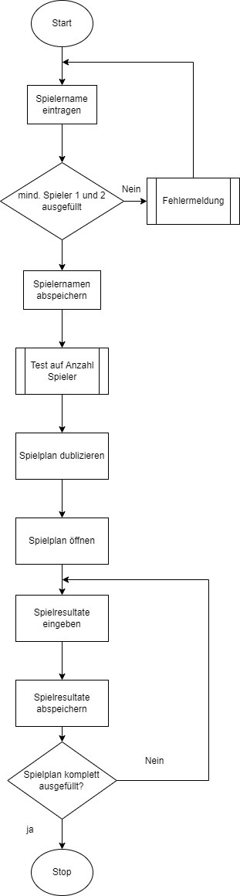

# Read Me
### Ausgangslage
Eines von meinen lieblings Spielen ist das Yazzi. Dieses Spiel beinhaltet lediglich fünf Spielwüfel, eine Punktetabelle und ein Bleistift um die Punkte in der Tabelle einzutragen. Da ich etwas für die Umwelt tun möchte und ich dieses Spiel sehr gerne spiele, kam ich auf die Idee die Punktetabelle zu digitalisieren.
### Funktion / Projektidee
Die Applikation soll an hand der Spieleranzahl eine Punktetabelle erstellen, in die alle Punkte eingetragen werden. Diese Punktetabelle soll mit dem Zeitstempel versehen und für die Zukunft abgespeichert werden.

Die gespeicherten Punktetabelle sollen mit anderen Spielen verglichen werden können und somit Statistiken daraus zihen können. Ebenso soll über alle gespielten Spiele hinweg eine Hiscore-liste erstellt werden die den Namen und die erzielte Punktzahl anzeigt.
## Workflow
### Dateneingabe
Zu beginn wird angegeben wieviele Spieler mitspielen wollen. Dann werden alle Namen erfasst. Falls bereits ein Spiel gespielt wurde, werden diese Namen zur Auswahl aufgelistet. So kann man seinen eigenen Hiscore verbessern und am Ende eine bessere Analyse aus den verschiedensten Spielen ziehen.

Während dem Spiel werden die Punkte in der Tabelle eingetragen. Sobald diese eingetragen wurden, wird ein automatischer Speicherprozess eingeleitet. Dies Hilft dabei, die Daten auch bei einem Netzwerkausfall oder Laptopabsturz zu behalten.
### Datenausgabe
Die Daten werden gespeichert und zur Analyse bereitgestllt. Ebenso wird immer eine Hiscore-Liste auf der linken Seite angezeigt über alle bereits gespeilten Spiele hinweg. Diese wird immer am Ende jedes Spieles aktuallisiert.
## Bedienung
Zur Verwendung der Applikation muss die main.py Datei gestartet werden.
## Diagramm
### Neues Spiel
